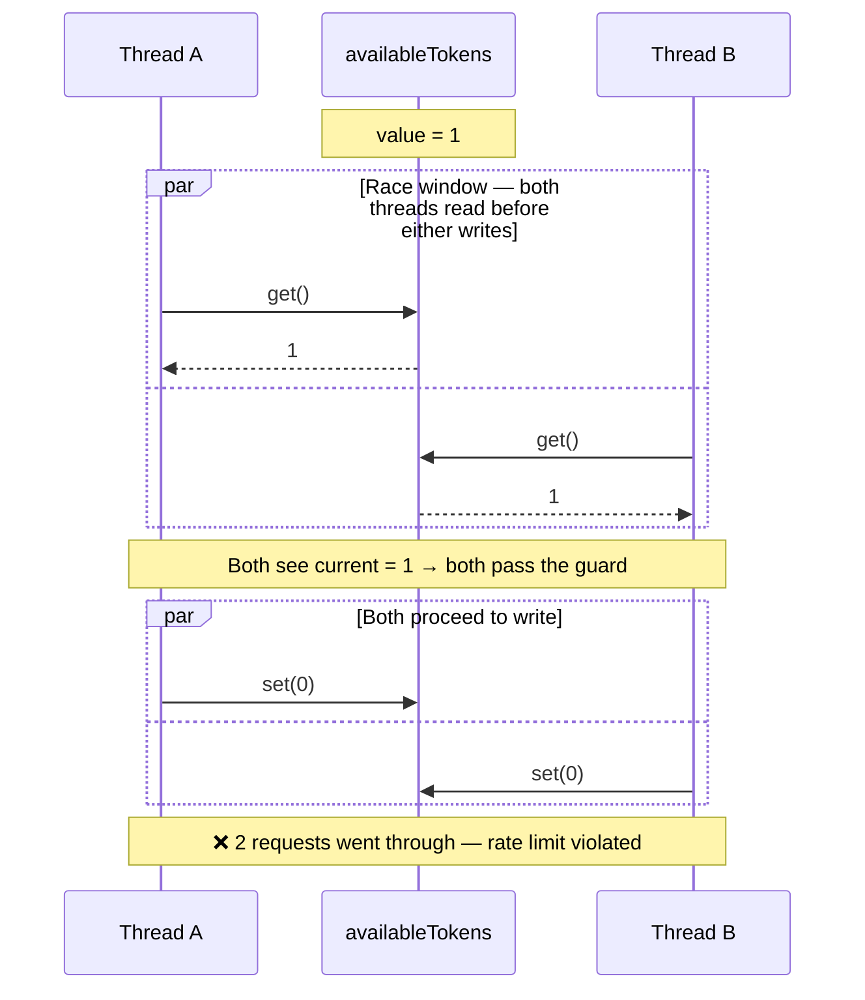
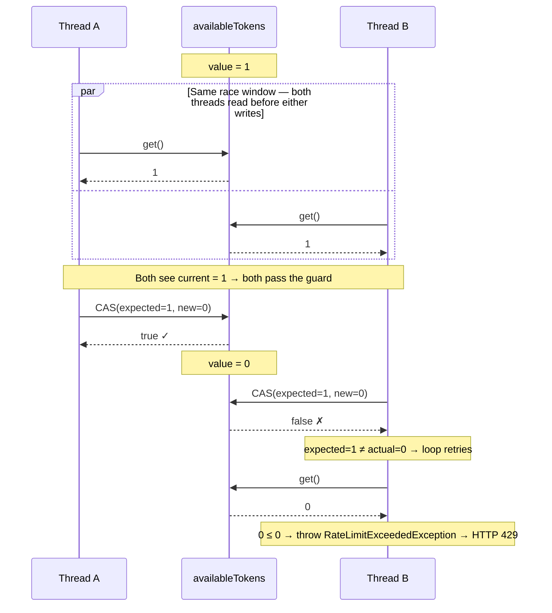

# GitHub API Rate Limiter — Implementation Notes

## Overview

GitHub restricts unauthenticated API calls to **60 requests per hour** per IP address.  
To prevent the application from hitting that ceiling and receiving `403 Forbidden` responses, a custom **token bucket rate limiter** is applied before every outbound GitHub API call — regardless of which HTTP client implementation is active (`restclient` or `httpclient`).

The limiter lives in `request.ratelimiter.impl.GitHubRateLimiter` and is backed by `RateLimiterProperties` for YAML-driven configuration.
---

## Algorithm: Token Bucket
The token bucket is one of the two classic rate-limiting algorithms (the other being the leaky bucket).

| Concept | Value (default) | Meaning |
|---|---|---|
| `capacity` | 60 | Maximum tokens the bucket can hold |
| `refillTokens` | 60 | Tokens added per refill interval |
| `refillIntervalSeconds` | 3600 | How often a refill occurs (1 hour) |

These defaults mirror GitHub's own unauthenticated rate limit exactly.

---

## Key Implementation Details

### 1. Thread Safety via `AtomicLong`

All mutable state is held in two `AtomicLong` fields:

```java
private final AtomicLong availableTokens;   // current token count
private final AtomicLong lastRefillNanos;   // timestamp of last refill
```

`AtomicLong` operations are lock-free — they use hardware-level CAS instructions instead of `synchronized` blocks, avoiding thread contention and context-switch overhead.

---

### 2. The CAS Loop in `acquire()`

#### Why the naive version is NOT thread-safe

A simple sequential implementation looks harmless at first glance:

```java
// ❌ NOT thread-safe
long current = availableTokens.get();       // step 1 — read
if (current <= 0) throw ...;               // step 2 — validate
availableTokens.set(current - 1);          // step 3 — write
```

The problem is the **gap between step 1 and step 3**. On a multi-threaded server, two request threads can interleave like this:



Both threads read `current = 1`, both pass the `> 0` guard, and both write `0`. The bucket had **1 token** but **2 requests went through** — the rate limit is violated.

This is a classic **check-then-act** race condition: the state can change between the moment you check it and the moment you act on it.

#### Why the do-while loop IS thread-safe

```java
// ✅ Thread-safe CAS loop
long current;
do {
    current = availableTokens.get();                          // 1. read
    if (current <= 0) throw new RateLimitExceededException(); // 2. validate
} while (!availableTokens.compareAndSet(current, current - 1)); // 3. atomic swap
```

`compareAndSet(expected, newValue)` is a **single atomic CPU instruction** (a hardware CAS — Compare-And-Swap). It does three things with no gap between them:

1. Reads the current value from memory
2. Compares it with `expected`
3. Writes `newValue` **only if** they match; otherwise does nothing and returns `false`

The same interleaving now plays out safely:



Thread B's `compareAndSet` fails because `availableTokens` is now `0`, not `1` as it expected. The `false` return triggers the `do-while` to loop back, re-read the fresh value (`0`), and correctly throw the exception.

The loop only retries when there is actual contention (another thread consumed a token at the exact same moment). In practice — given GitHub's 60 req/hour limit — contention is extremely rare, so the loop almost always exits on the first iteration.

---

### 3. Refill Logic: `periods` and `newLast`

```java
long periods = elapsed / refillIntervalNanos;
long newLast  = last + periods * refillIntervalNanos;
```

**`periods`** — complete refill intervals elapsed, via integer division (fractional remainder discarded):

$$\text{periods} = \left\lfloor \frac{\text{elapsed}}{\text{interval}} \right\rfloor$$

Example: 2.5 h elapsed, 1 h interval → `periods = 2`. Two refills applied; 0.5 h carries forward.

**`newLast`** — anchor timestamp set to `last + periods × interval` rather than `now`. This preserves the fractional remainder so it rolls into the next window, keeping the long-term rate accurate.

The `compareAndSet` on `lastRefillNanos` ensures only **one** thread performs the refill even when many detect it simultaneously.

---

## Configuration

```yaml
rate-limiter:
  capacity: 60
  refill-tokens: 60
  refill-interval-seconds: 3600
```

Backed by `request.config.RateLimiterConfig` (`@ConfigurationProperties(prefix = "rate-limiter")`).

---

## Integration with Services

`GitHubRateLimiter` is injected into both service implementations and called as the **first statement** of every method making an outbound call:

```java
public List<GitHubUser> getAllUsers() {
    rateLimiter.acquire();   // throws HTTP 429 if bucket is empty
    // ... HTTP call
}
```

---

## Exception Flow

```
rateLimiter.acquire()
    └─ RateLimitExceededException (RuntimeException)
            └─ GlobalExceptionHandler.handleRateLimitExceeded()
                    └─ HTTP 429 Too Many Requests
                            └─ ExceptionDTO<ApiErrorResponse> (JSON body)
```
